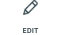
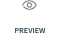
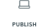
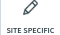
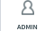
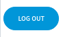
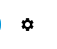

Admin Panel
===========

In this article:
    - `Introduction`_
    - `Panel Features`_

------------
Introduction
------------

ImCMS 6 provide new modern Admin Panel with several features.
In order to get to the admin panel, you need to move the mouse up, but you can change this in settings.

--------------
Panel Features
--------------

.. |pageInfoIcon| image:: admin-panel/_static/page-info.png
    :width: 60pt

.. |documentsIcon| image:: admin-panel/_static/documents.png
    :width: 60pt

- |publicModeIcon| Public Mode - view the published version.

- |editModeIcon| Edit Mode - open the content editing mode of the working version.

- |previewIcon| Preview Mode - view a preview of the working version.

- |publishIcon| Publish - publish a current document.

- |pageInfoIcon| Page Info - open the `Page Info </how-to-use/document-management/page-info/base>`.

- |siteSpecific| Site Specific - TODO ADD TEXT.

- |documentsIcon| Document Manager - open the `Document Manager </how-to-use/document-management/document-manager>`.

- |adminManagerIcon| Admin Manager - open the Superadmin page.

- |logoutIcon| Logout - logout current user from the system.

- |settingPanelIcon| Setting panel - open admin panel settings.
